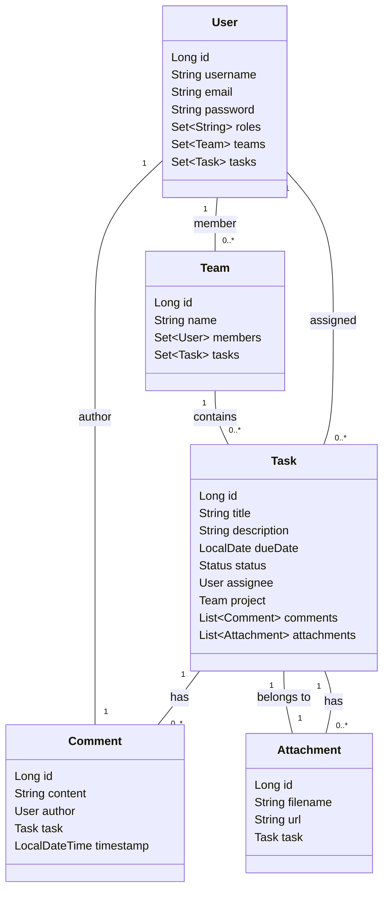
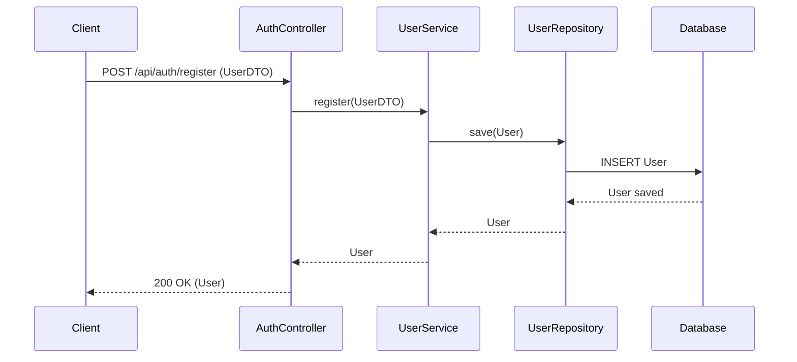
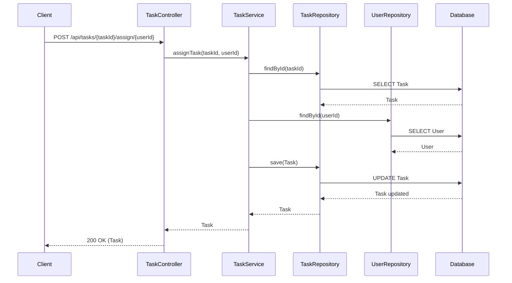

# Task Tracking System Backend: Architecture & Design

---

## 1. Technology Stack
- **Language:** Java
- **Framework:** Spring Boot
- **Build Tool:** Maven
- **Database:** MySQL (Spring Data JPA)
- **Security:** Spring Security with JWT
- **File Uploads:** Disk storage, static serving
- **API Style:** RESTful

---

## 2. High-Level Architecture

```
[Client]
   |
   v
[Controller Layer]  <--- REST API endpoints
   |
   v
[Service Layer]     <--- Business logic
   |
   v
[Repository Layer]  <--- Data access (JPA)
   |
   v
[Database]          <--- MySQL
```

---

## 3. Main Packages & Classes

- **model/**: User, Task, Team, Comment, Attachment
- **repository/**: JPA repositories for each model
- **dto/**: Data Transfer Objects for API
- **service/**: Business logic interfaces and implementations
- **Controller/**: REST API endpoints
- **security/**: JWT, authentication, security config
- **util/**: File upload utility
- **exception/**: Global exception handler

---

## 4. Class-Level Architecture Diagram



---

## 5. Detailed Sequence Diagram: User Registration & Task Assignment

### a) User Registration


### b) Task Assignment


---

## 6. Security & Authentication Flow
- Registration: User registers with username, email, password (hashed), roles
- Login: User logs in, receives JWT
- JWT: Sent in Authorization header for protected endpoints
- Spring Security: Validates JWT, loads user details, enforces access

---

## 7. File Uploads
- Attachments uploaded via `/api/attachments/upload/{taskId}`
- Files saved to `uploads/` directory
- URLs stored in DB, served as static resources

---

## 8. Error Handling & Validation
- GlobalExceptionHandler returns clean error messages
- DTOs can use validation annotations for request validation

---

## 9. Example API Usage
See `API_TESTING.md` for ready-to-use curl/Postman requests for all endpoints.

---

## 10. Project Setup
- Configure MySQL in `application.properties`
- Run `mvn clean install` to build
- Start with `mvn spring-boot:run`
- Use the API as documented 
